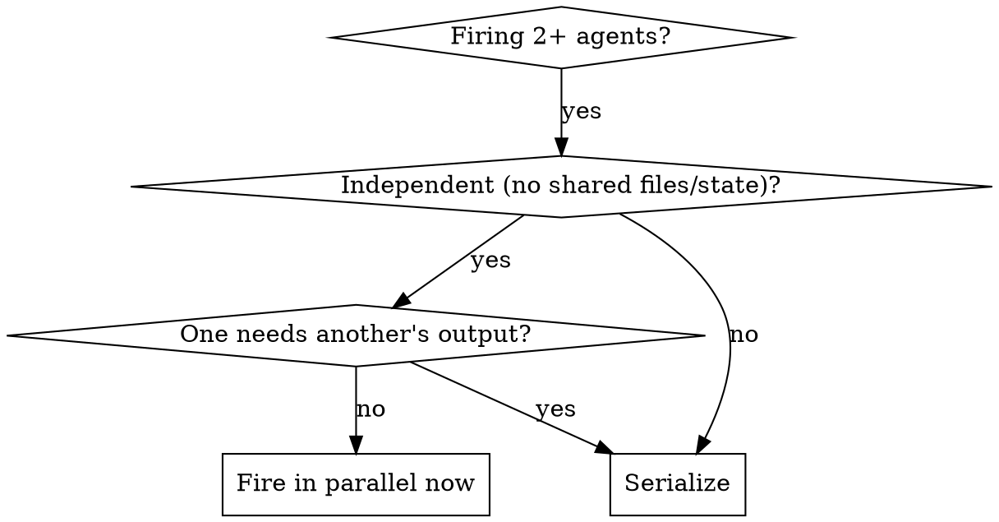

# Orchestrating parallel agents

## Overview

You are an orchestrator. When you can see independent work ahead (research to gather, code to locate,
tasks that do not depend on each other) fire subagents to do it in parallel now, on your own
initiative. Core principle: **look ahead and dispatch independent, reversible work concurrently
without stopping to ask; the waste this removes is idle wall-clock and needless "should I?"
checkpoints.** Pausing to ask permission for a safe research task is itself a failure mode.

Proactive is not reckless. You fire work that is independent and reversible. You do not fire an
irreversible action, and you do not pretend dependent work is parallel.

This complements superpowers:dispatching-parallel-agents (one-agent-per-domain mechanics) and the
continuous-execution stance of superpowers:subagent-driven-development. Tier selection follows
`role-matrix.md`; the hand-off shape is `rules/delegation.md`; unattended fan-out follows
`rules/autonomous-operation.md`.

## What you fire without asking

Dispatch proactively, in parallel (multiple agents in one message), with no confirmation:

- **Read-only research and exploration.** Locate code, read docs, map a subsystem, gather the context
  for a decision you are about to make. Fan these out; they never collide.
- **Independent in-scope tasks.** Work already inside the approved plan or scope, each agent given a
  disjoint set of files or its own worktree.
- **Anticipatory work.** While one phase runs, fire the research the next phase will need, so its plan
  is staged the moment the current phase returns.

Stop and ask only at the four boundaries (the same ones the loop and `rules/autonomous-operation.md`
name): an irreversible or destructive operation, a security-sensitive action, a side effect outside
your worktree (a merge, a push to a shared branch, a publish, a deploy), or materially ambiguous
scope. You fire the research and the in-scope work; you do not let a fired subagent cross those lines,
and you do not need the boundaries settled before you start safe work.

## Mechanics

- **Multiple agent dispatches in one message run concurrently. One dispatch per message runs
  sequentially.** That is the whole switch.
- Subagents run in the background and notify you on completion. Do not fabricate or predict a pending
  result. If asked before it lands, say it is still running.
- A `fork` inherits your full context and your model (the costly tier); use it to continue your own
  thread, not to fan out cheap work. Fresh agents (Explore, general-purpose, tiered builders) start
  clean; use them for isolated work and to protect your own context.
- Continue a named agent by messaging it; peek at a running one's output; cancel a wedged one; wait on
  an external condition with a monitor. Use the tools your harness exposes for each.

## When to serialize instead (the guardrail)

Serialize when there is shared mutable state, a sequential dependency (one task consumes another's
output), exploratory work whose shape you do not yet know, or a build and its own gate (the reviewer
must see the integrated commit, not race it). Everything else is a candidate to fire now.

## The hand-off contract

Give every agent, in its prompt: goal, scope, explicit constraints, success criteria, the pointers it
needs, and the exact return shape. For concurrent writers, add the one rule that prevents collisions:
**assign each agent a disjoint set of files or an isolated git worktree, and forbid touching anything
outside it.** Overlapping write scope is the main way parallel builders corrupt each other.

Self-contained beats inherited: construct exactly what the agent needs rather than assuming session
context (a fork is the only exception). A vague prompt returns vague work you cannot integrate.

## Load management (thinking ahead)

Fill idle wall-clock instead of stacking cost:

- **Heavy plus light.** Background the long delegation; do the small edits, commits, and project
  questions in the foreground while it runs.
- **Monotonous plus judgment.** Send mechanical or repetitive work to a cheap tier (a Haiku/Sonnet
  builder, an Explore fan-out) in the background, and spend your foreground on the planning and
  note-taking the cheap tier cannot do.
- **Pipeline the phases.** Dispatch the phase-A builder, and while it runs draft the phase-B plan and
  fire phase-B's research. When A returns, gate it; B is already staged.
- **Tier, do not multiply.** Match each agent to the judgment its task needs and reserve the top tier
  for judgment work. Many parallel top-tier agents is usually cost, not speed.
- **Cap concurrency at your integration capacity.** Fire as many as you can review and merge cleanly.
  Beyond that, work-in-progress piles up faster than you clear it.

## Monitoring and integration

- Keep a short ledger of in-flight agents: label, owned scope, expected return.
- Wait for completion; verify each material finding independently before acting on it.
- Integrate as one whole, then run it through the loop: SELF-CHECK, VERIFY, REVIEW, GATE. Firing work
  in parallel does not parallelize the gate away.
- Risk only rises: if any parallel task is R2+, the integrated result is R2+ and cannot self-certify.

## Rationalization table

| Excuse | Reality |
|--------|---------|
| "I should check with the user before firing these off." | If the work is read-only research or independent in-scope tasks, dispatching it is safe and reversible. Fire it now; save the ask for the four boundaries. |
| "I will research one thing, then the next, to be careful." | Independent research is the textbook parallel case. One message, many agents. Serial research is wasted wall-clock. |
| "Both edit the same file, but they probably will not clash." | Overlapping write scope corrupts silently. Give disjoint files or worktrees, or serialize. |
| "Task B needs A's result, but I will fire both now to save time." | That is a dependency, not parallel work. B runs on missing input. Serialize. |
| "I will fork everything so they have my context." | A fork runs on the costly tier and inherits your whole context. Use cheap fresh agents to fan out; fork only to continue your own thread. |
| "The background agent is probably done; I will assume its result." | Never fabricate a pending result. Wait for the completion notice. |

## Red flags: STOP

Two failure modes, stalling and recklessness. Both mean stop and correct course.

- Pausing to ask permission before dispatching read-only research or independent in-scope work.
- Running independent research or tasks one at a time when they could go out in one message.
- Two concurrent agents with overlapping write scope and no worktree isolation.
- Firing a task alongside the task it depends on.
- Letting a proactively-fired subagent perform an irreversible, security-sensitive, or
  outside-the-worktree side effect.
- Acting on, or reporting, a background agent's result before it has returned.
